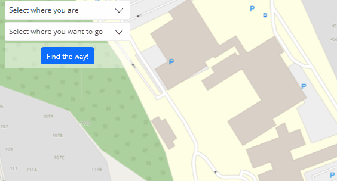
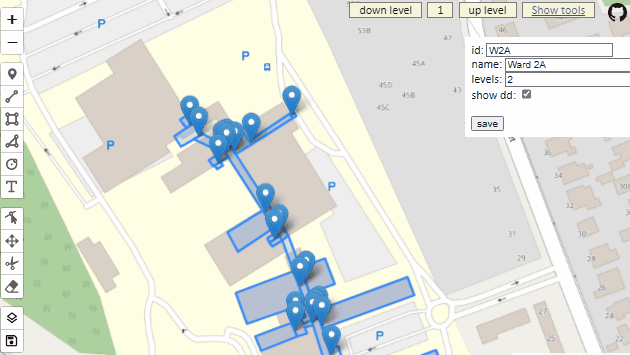

# :world_map: pathfinding PoC :compass:	

A proof of concept that allows users to find a path through a complex grouping of buildings. This is express.js, using Leaflet and Geoman for the mapping and drawing. Map is from OpenStreetMap. 
Data is stored in postgres using Neon as a host. The application is hosted on Vercel at https://pathfindingpoc.vercel.app/viewer.html

The UI to find a path looks like this:

The editor to set it all up looks like this:

